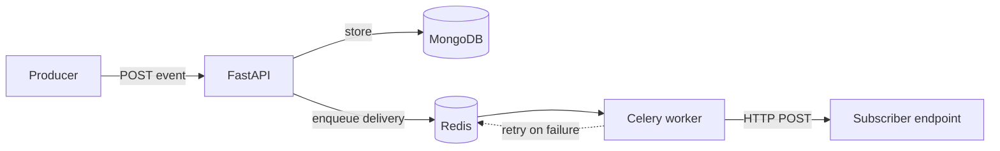

<p align="center">
  
</p>

<p align="center">
  
</p>

<p align="center">
  <a href="https://www.linkedin.com/in/pramod-dixit-2b36b91bb/"></a>
  <a href="https://leetcode.com/u/pramoddixit608/"></a>
</p>

I build backend services, and I want to understand everything underneath them: the runtime, the memory model, the operating system, and the CPU executing the instructions. My default question is **"how does this actually work?"**, and I keep asking it until the answer reaches the hardware.

Right now that means building **Relay**, a webhook delivery service, while learning Rust, operating systems and computer organization from first principles.

## 🔭 Currently

- 📬 **Building Relay**: a webhook delivery service with FastAPI, MongoDB, Celery and Redis
- 🧮 **Studying computer organization**: how an instruction moves through fetch → decode → control signals → ALU → write-back
- 🐧 **Studying operating systems** (*Operating System Concepts*, Silberschatz): processes, threads, scheduling, and how they map onto physical cores and SMT
- 📐 **Math for ML**: multivariable calculus and linear algebra, then deep learning from scratch

## 🚀 Featured work

### 📬 Relay: webhook delivery service `🚧 in progress`

A service that accepts events and delivers them to subscriber endpoints. Delivery runs in background workers, so the API never waits on a slow subscriber, and failed deliveries are retried instead of dropped.



`Python` · `FastAPI` · `MongoDB` · `Celery` · `Redis`

### ⚙️ Low-level experiments

- **ARM32 assembly by hand**: programs that load values, convert numbers to ASCII, store bytes into a buffer with `strb` and print them through a raw Linux `write` syscall. Assembled with `as`, linked with `ld`, and run under `qemu-arm` on an AArch64 Ubuntu VM
- **Calling conventions**: `bl` vs `b`, saving `lr` before nested calls, callee-saved `r4–r11`, returning with `pop {pc}`
- **Syscalls across ISAs**: ARM `svc`/`swi` vs x86 `syscall`, and how Linux reads the syscall number from register state
- **x86 assembly** with NASM + GCC
- **Networking**: exposed a Node.js app from a home network, hit ISP-level CGNAT that blocks inbound port forwarding, and worked around it with tunneling

## 🪜 Top to bottom

The layers I build in, and the ones I'm digging into:

```text
  ▲  application  web backends · REST APIs · auth · Node.js · Django · FastAPI
  │  language     C · Rust — what does this compile to, and where does it live?
  │  memory       stack vs heap · allocation · fragmentation · object layout
  │  OS           processes · threads · scheduling · syscalls
  │  ISA          ARM32 assembly — registers · stack frames · svc
  ▼  CPU          datapath · control unit · ALU · fetch → decode → execute

  ▲ building software                                 ▼ understanding computers
```

## 🧠 Technical depth

| Area | Worked with | Going deeper |
| --- | --- | --- |
| 🌐 **Backend** | Node.js/Express, Django, REST APIs, authentication & OAuth, MySQL, MongoDB | FastAPI, Celery, Redis, background job processing |
| 🔩 **Low-level** | C (pointers, structs, bit manipulation, signed vs unsigned), ARM32 assembly, Linux syscalls, x86 with NASM | Rust's memory model, C object layout & alignment, how compilers lower code |
| 🖥️ **Architecture** | Registers, stack frames, calling conventions, cache lines & locality | Datapath, control unit, ALU, CPU microarchitecture |
| 🐧 **Operating systems** | Stack vs heap, allocation & fragmentation, user space vs kernel, concurrency vs parallelism | Processes, threads, scheduling, context switches, SMT |
| 🧩 **Algorithms** | Strong in dynamic programming, backtracking, divide & conquer, graphs (BFS/DFS, connected components, cycle detection), trees, recursion | How memory layout and pointer chasing affect real performance |
| 📊 **Data & ML** | NumPy, pandas, Matplotlib, Seaborn, scikit-learn; statistical visualization (KDE, histograms, box plots, IQR, confidence intervals) | PyTorch, deep learning from scratch, backpropagation |
| 📐 **Math** | Multivariable calculus (partial & directional derivatives, gradients, gradient descent), linear algebra (span, basis, dot products, matrix multiplication) | Matrix calculus for backprop, probability & statistics |
| 🌍 **Networking** | NAT, private IPs, port forwarding, CGNAT, tunneling | TCP vs HTTP, what ASGI servers actually do |
| 🧰 **Tooling** | Linux (Ubuntu), zsh with vi-mode, Vim/LazyVim, QEMU, GNU binutils, Git | Neovim configuration |

## 🧭 How I work

- 🔍 **First principles over memorization.** What problem does this solve, what is the mechanism, what is physically happening, and only then the formal definition.
- 🐞 **Debug to the root cause.** For example, I traced the ARM assembler error *"expected a register or register list"* to a mismatch between ARM32 and AArch64 toolchains, and worked through MySQL's `ER_NOT_SUPPORTED_AUTH_MODE` between Node.js and MySQL authentication.
- 🧪 **Test my own mental models.** I check where a value actually lives, which register holds what, and whether "the stack is faster" survives a look at locality and access patterns.

## 🛠️ Tech stack

**Comfortable with**

<p>
  
</p>

**Learning**

<p>
  
</p>

## 📊 GitHub stats

<p align="center">
  
  
</p>

## 📫 Let's connect

Open to software engineering roles in **backend, systems or data**. The fastest way to reach me is [LinkedIn](https://www.linkedin.com/in/pramod-dixit-2b36b91bb/).

<p align="center">
  
</p>
