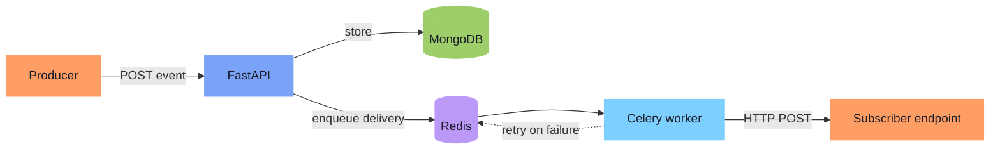

  

   
   
   
   
   
  

##  About me

 &nbsp;Currently building **Relay**, a webhook delivery service 
 &nbsp;I work mostly on **backend, data science and low-level programming**: REST APIs, backend services, background jobs, data analysis, ML models and systems-level code 
 &nbsp;Going deeper into **machine learning**, from the math behind a model to how it learns 
 &nbsp;Spent a lot of time on **low-level programming**: memory layout, stack vs heap, pointers and system calls 
 &nbsp;Studying **operating systems and computer architecture** to understand what really happens beneath my code 
 &nbsp;I enjoy solving **algorithmic problems**, especially dynamic programming, graphs and recursion 
 &nbsp;I like learning things from **first principles**, and I keep asking "why?" until I hit the hardware 
 &nbsp;Ask me about backend, data science and ML, or systems internals: memory management, operating systems and computer architecture 
 &nbsp;Open to opportunities in **backend, data science and ML**

##  Currently building: Relay

A webhook delivery service. It accepts events, delivers them to subscriber endpoints in background workers, and retries failed deliveries instead of dropping them.

  
  
  
  
  
  

##  How I learn: from apps to hardware

I learn by going down the stack. I start at the top by building something real, like a backend, an API or an ML model. Then I follow my code down one layer at a time, asking what runs it, who manages it and what finally executes it, until I understand what the machine is actually doing.

  

⬆️ building software &nbsp;·&nbsp; understanding computers ⬇️

##  Tech stack

<b>Languages</b>

  
  

<b>Backend & databases</b>

<b>Data science & ML</b>

  
  
  
  
  

<b>Tools</b>

##  GitHub stats

  
  

##  Reach me

  
  
  

